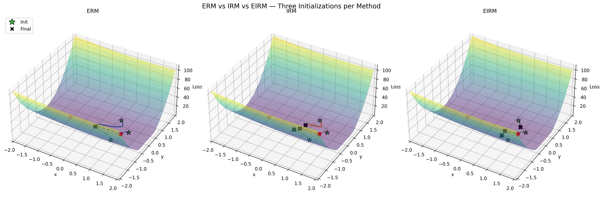

# EIRM: Extended Invaraint Risk Minization

The repository contains the codes of the paper entitled
_"Extended Invariant Risk Minimization for Machine Fault Diagnosis
with Label Noise and Data Shift"_, which has been accepted for publication
on IEEE Transactions on Neural Networks and Learning Systems.

## Sharp minima prevention
EIRM couples the ideas of learning invariance with flat minima optimization. The image shows its effect of sharp minima prevetion.

The objective function is a softmin function with two basins, sharp (left) and flat (right). The gradients of ERM, IRM, and EIRM are used in a gradient descent fashion to minimize the objective funtion. This toy example is implemented by `toy.py`. (The toy example was created during a discussion with Geng TANG, DS, CityUHK. )

## Usage
Use `eg_sweep.sh` to run an example of sweeping experiments and use
`eg_results.sh` to collect the results.

## Acknowledgement
The repo is developed from [DomainBed](https://github.com/facebookresearch/DomainBed).

## Citation
If you find this repo useful, please cite our paper (update later):

    @article{mo2024extended,  
    author={Mo, Zhenling and Zhang, Zijun and Miao, Qiang and Tsui, Kwok-Leung},
    journal={IEEE Transactions on Cybernetics}, 
    title={Extended Invariant Risk Minimization for Machine Fault Diagnosis with Label Noise and Data Shift}, 
    year={2025},
    volume={36},
    number={8},
    pages={15476-15489},
    doi={10.1109/TNNLS.2025.3531214}}

If you use the SichuanU dataset (the gearbox dataset), please cite the above paper or the below paper:

    @article{mo2024sparsity,  
    author={Mo, Zhenling and Zhang, Zijun and Miao, Qiang and Tsui, Kwok-Leung},
    journal={IEEE Transactions on Cybernetics}, 
    title={Sparsity-Constrained Invariant Risk Minimization for Domain Generalization With Application to Machinery Fault Diagnosis Modeling}, 
    year={2024},
    volume={54},
    number={3},
    pages={1547-1559},
    doi={10.1109/TCYB.2022.3223783}}
